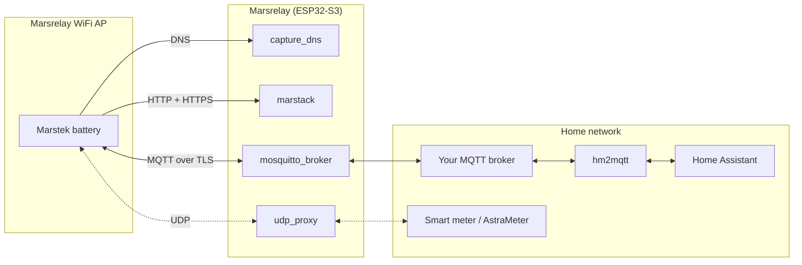

# Marsrelay

Marsrelay runs your Marstek Energy Storage system **completely offline**: a small ESP32-S3 device emulates the Marstek cloud locally, so the battery works without internet while all data and controls flow into your home automation via MQTT.

- **No cloud, no internet** — all data stays in your home network
- **No device hacking** — you only point the battery's WiFi at Marsrelay's access point
- **Home Assistant integration** via [hm2mqtt](https://github.com/tomquist/hm2mqtt)

<!-- marstek-family:start -->
**🔋 The Marstek ecosystem.** This repo is part of a family of open-source tools for Marstek batteries (B2500, Venus, Jupiter, …):

| Project | What it does |
|---|---|
| [hm2mqtt](https://github.com/tomquist/hm2mqtt) | Brings your battery into your smart home, turning its raw data into readable sensors and controls (e.g. in Home Assistant) |
| [hame-relay](https://github.com/tomquist/hame-relay) | Connects the official Marstek cloud/app and your local smart home so both work together, forwarding data whichever way your battery is set up |
| **marsrelay** (this repo) | Runs your battery completely offline, with no internet or Marstek cloud, while still sending all its data to your smart home |
| [AstraMeter](https://github.com/tomquist/astrameter) | Tells your battery your live grid usage (read from your existing meter) so it charges and discharges to avoid buying or selling power |
| [hmjs](https://github.com/tomquist/hmjs) | Sets up and configures B2500 batteries over Bluetooth, right from your web browser, with no app or account needed |
| [esphome-b2500](https://github.com/tomquist/esphome-b2500) | Continuously monitors and controls a B2500 over Bluetooth using a small ESP32 board |
<!-- marstek-family:end -->

## How It Works

Marstek batteries talk to two cloud services: an HTTP API and an MQTT broker. Marsrelay emulates both on one ESP32-S3:

1. **WiFi access point** (`wifi`): the battery connects to it, while Marsrelay stays connected to your home WiFi
2. **DNS capture** (`capture_dns`): every cloud hostname lookup is answered with Marsrelay's own IP
3. **Cloud HTTP emulation** (`marstack`): answers the Marstek cloud endpoints the battery calls — clock sync via `getDateInfoeu.php` on port 80, and the TLS telemetry upload a Venus expects on port 443 (see [Venus: the network dropouts every 15 minutes](#venus-the-network-dropouts-every-15-minutes))
4. **Cloud MQTT emulation** (`mosquitto_broker`): a TLS broker on port 8883 accepts the battery's cloud MQTT connection — battery data (`.../device/...` topics) is forwarded to your home broker, commands (`.../App/.../ctrl`) are relayed back
5. **UDP proxy** (`udp_proxy`): bridges power meter broadcasts between both networks for zero feed-in



The battery thinks it's online; the Marstek app keeps working via Bluetooth only. You still need **hm2mqtt** on top — Marsrelay only moves raw MQTT messages, hm2mqtt parses them and creates the Home Assistant entities. **[Hame Relay](https://github.com/tomquist/hame-relay)** is *not* needed: it bridges the real cloud, which an offline setup doesn't have.

## Setup

You need: an ESP32-S3 board ([single](https://amzn.to/429OJDX) with "octal" PSRAM, [3-pack](https://amzn.to/3PwGRVv), [3-pack mini](https://amzn.to/4qIjp8P) with "quad" PSRAM), [ESPHome](https://esphome.io/) (e.g. the Home Assistant add-on), an MQTT broker, and [MQTT Explorer](https://github.com/thomasnordquist/MQTT-Explorer).

### 1. Flash Marsrelay

Download [`marsrelay_esp32s3.yaml`](marsrelay_esp32s3.yaml) and adjust the `substitutions:` block at the top:

- **`wifi_ssid` / `wifi_password`**: your home WiFi
- **`ap_ssid` / `ap_password`**: the WiFi network your battery will connect to
- **`mqtt_broker` / `mqtt_username` / `mqtt_password`**: your home MQTT broker
- **`timezone`**: used to keep the battery clock in sync ([timezone list](https://en.wikipedia.org/wiki/List_of_tz_database_time_zones))
- **`udp_proxy_port`**: depends on your power meter / firmware (see the comment in the file)
- **`psram`**: must match your board ([details](https://esphome.io/components/psram/))

Then build and flash it with ESPHome.

### 2. Connect the battery

In the battery's WiFi settings, connect it to the Marsrelay access point (`ap_ssid` / `ap_password`). That's all the battery-side setup — no hacks, no firmware modification.

### 3. Find your device information

With Marsrelay up and running, power-cycle the battery once: it clears the battery's DNS cache, so the cloud hostnames are looked up again and now resolve to Marsrelay. A battery that joined the access point earlier can otherwise stay quiet for a long time.

Then, in MQTT Explorer (connected to your home broker), wait for a message on `marstek_energy/<deviceType>/device/<deviceId>/ctrl` — or `hame_energy/...` on older firmware. **Give this at least 30 minutes** from the power cycle — the first message usually arrives within 20, but longer is normal. Note down `deviceType` and `deviceId`.

- Ignore `.../App/...` topics — those are commands *sent by* hm2mqtt, not by your battery.
- Nothing appearing? See [troubleshooting](docs/troubleshooting.md#no-device-topic-ever-appears). You can also read the ID from Hame Relay's startup logs instead of waiting (see [finding the encrypted ID](#finding-the-encrypted-id)).

### 4. Configure hm2mqtt

On current firmware the `deviceId` from step 3 is almost always a long **encrypted ID**, not the battery's MAC address. What goes into [hm2mqtt](https://github.com/tomquist/hm2mqtt) depends on the device family:

- **B2500/Saturn (HMA/HMB/HMF/HMK/HMJ types):** use the **Bluetooth MAC** as `deviceId` — never the encrypted ID — and add an `id_mappings` entry in Marsrelay. See [Device IDs](#device-ids-mac-address-vs-encrypted-id).
- **Venus, Jupiter and everything else:** use the ID from step 3 as `deviceId`, exactly as it appears in the topic.
- If the topic shows a plain 12-digit MAC (older firmware, or a B2500 configured for local MQTT): just use that — done.

## Device IDs: MAC Address vs. Encrypted ID

Every Marstek battery has a Bluetooth MAC address (12 hex characters, e.g. `009b08a571ee`), shown in the Marstek app and used by [hm2mqtt](https://github.com/tomquist/hm2mqtt) as the `deviceId`. In its cloud MQTT topics, however, a battery on current firmware identifies itself with a long **encrypted ID** instead — only old firmware still uses the plain MAC there, and a firmware update silently switches a battery over (see the [Hame Relay device matrix](https://github.com/tomquist/hame-relay/blob/main/docs/device-matrix.md) for which versions).

Marsrelay forwards topics as-is, so the ID from step 3 is whatever the battery uses. In the rare case that it's the plain MAC: configure it in hm2mqtt and you're done. Otherwise, follow the section for your device family:

### B2500 / Saturn (device types starting with HMA, HMB, HMF, HMK, HMJ)

- **hm2mqtt:** `deviceId` = the **Bluetooth MAC**, never the ID from the topic. hm2mqtt derives its own topic IDs from this value; pasting the topic ID instead sends commands to dead, double-encrypted topics (recognizable as ~96-character IDs in the Marsrelay log).
- **Marsrelay:** map the battery's topic ID to the MAC:

  ```yaml
  mosquitto_broker:
    # ...existing options...
    id_mappings:
      - device: "<id-from-the-device-topic>"   # from step 3
        external: "<bluetooth-mac>"
  ```

Marsrelay rewrites the IDs in both directions and automatically uses the form hm2mqtt expects per topic (plain MAC on `hame_energy/...`, hm2mqtt's encrypted variant on `marstek_energy/...`). The mapping is a harmless no-op when the IDs already match, so just always add it. Requires a current build from `main`; older configs that set the encrypted variant as `external` manually keep working.

> Exception: a B2500 configured for **local MQTT** (e.g. via [hmjs](https://tomquist.github.io/hmjs/)) publishes under its plain MAC — MAC in hm2mqtt, no mapping needed.

### Venus, Jupiter and all other device types (VNS…, JPLS…, HMG…, HMM…, …)

hm2mqtt uses the configured `deviceId` as-is for these devices, so pick one of two options:

- **Option A — encrypted ID in hm2mqtt (simplest):** configure the ID from step 3 as the `deviceId`, e.g. `DEVICE_0=JPLS-8H:<encrypted-id-from-the-device-topic>`.
- **Option B — MAC plus mapping:** keep the Bluetooth MAC as `deviceId` in hm2mqtt and add the same `id_mappings` entry as above (`device:` the encrypted ID, `external:` the MAC).

With multiple batteries, make sure each mapping pairs the IDs of the **same physical battery** — see [Finding the encrypted ID](#finding-the-encrypted-id).

### Finding the encrypted ID

1. **MQTT Explorer:** wait for the battery's `.../device/<deviceId>/ctrl` topic (step 3, 30 minutes or more). With multiple batteries, power all but one off to attribute the IDs unambiguously.
2. **Hame Relay startup logs:** temporarily install [Hame Relay](https://github.com/tomquist/hame-relay) with your Marstek account credentials — on startup it prints each device's MAC and encrypted ID:

   ```text
   Device 1:
     Device ID: 009b08a571ee
     Remote ID: defa85f58f79ab2d2b2818f0a8cd3ee3   <-- the encrypted ID
     Type: HMJ-2
   ```

   This works even if the battery never publishes (or has never connected to Marsrelay); uninstall Hame Relay again afterwards.

## Venus: the network dropouts every 15 minutes

Marstek Venus batteries (E, D, E v3) on **control firmware v150** buffer their telemetry and upload it to the Marstek cloud. When an upload goes unacknowledged the buffer never drains — and the firmware then hardware-resets its own network chip on a fixed timer: every 900 s over WiFi, every 1800 s over Ethernet. For two to five seconds the chip is simply gone, so Modbus TCP sessions die, MQTT drops, and even ping stops answering. Then everything comes back, and the clock starts again.

A battery on Marsrelay's access point is a battery on WiFi that cannot reach the cloud, so it is the 900-second variant that applies.

Marsrelay answers that upload. `marstack`'s `https:` block serves `POST /data-upload/v1/venus/<id>` on port 443 with the acknowledgement the firmware waits for, the buffer stays empty, and the reset never fires. It is enabled in [`marsrelay_esp32s3.yaml`](marsrelay_esp32s3.yaml) and needs no DNS setup of your own — `capture_dns` already points every cloud hostname, `marstekcloud.com` included, at the ESP32:

```yaml
marstack:
  id: marstack_http
  https:
    port: 443
```

Nothing on the battery changes, and no telemetry leaves your network.

What that reply looks like is not a matter of taste. The firmware checks the body with `strstr` for `"code":` followed by `atoi`, so it has to evaluate to **0** — and the framing around it matters just as much: a reply with the same body but ordinary headers in an ordinary order is rejected, after which the battery retries four times and gives up. So `marstack` reproduces the real cloud's response byte for byte (header set, header order, chunked framing) and then holds the connection open for 25 seconds before closing it cleanly, because cutting it earlier makes the firmware throw away a reply it had already received. `raw_responses: false` goes back to ordinary framing if you ever need to compare.

### Your telemetry, locally

Every upload carries about seventy fields. `on_venus_upload` decodes the ones whose meaning is confirmed and passes the rest through untouched; the example config publishes the result to `<mqtt_topic_prefix>/venus/<deviceId>/telemetry`:

```json
{"soc": 57, "battery_power": -412, "battery_voltage": 52.31, "grid_power": -398,
 "temperature_internal": 24.1, "control_firmware": "150", "unmapped": {"...": "..."}}
```

That is data the battery pushes on its own, separate from the MQTT side — you still want [hm2mqtt](https://github.com/tomquist/hm2mqtt) for Home Assistant entities.

### What this does not fix

The periodic resets stop. A second, smaller interruption does not, and it is worth knowing about before you go looking for it. Since v150 the upload runs over TLS, and a key exchange costs the battery's MCU around four seconds during which it stops serving Modbus — roughly twelve such gaps an hour, one per upload. It keeps answering ping throughout, so it is easy to tell apart from a reset, and it happens with the real cloud too. If you poll the battery over Modbus, raise your client's response timeout above ~8 seconds.

One caveat is specific to serving this from an ESP32: the TLS version range the battery accepts could not be read out of its firmware, and ESP-IDF's mbedTLS no longer implements TLS 1.0 or 1.1, so Marsrelay offers TLS 1.2. If the log shows `TLS handshake with ... failed`, that is the likely reason — please open an issue with the log line.

### Settings

All optional. The defaults are what the behaviour described above assumes; `hold_time` in particular is not a knob to turn down.

| Option | Default | Meaning |
|---|---|---|
| `https.port` | `443` | where the TLS listener binds |
| `https.hold_time` | `25s` | how long an answered connection is held before a clean close. Must exceed the battery's own 20 s receive timeout, or be `0s` to close at once |
| `https.max_body` | `8192` | bytes kept from an upload body |
| `https.max_connections` | `4` | connections that may be held open at once |
| `https.accept_all` | `false` | answer *every* path with `{"code":0}`, not just the upload. Off deliberately: answering an endpoint whose expected reply nobody has reverse-engineered can change what the battery does in untested ways. Watch the log first |
| `raw_responses` | `true` | reproduce the cloud's exact response framing on both ports |
| `time_suffix` | `"04_0_0_0"` | the four trailing fields of the clock reply, mirrored from the real endpoint rather than invented |

## Optional: Shelly UDP Emulator

Marsrelay can emulate a Shelly Gen2 energy meter (UDP JSON-RPC) directly on the ESP32, fed by ESPHome sensor values — based on the Shelly emulation in [AstraMeter](https://github.com/tomquist/AstraMeter) (formerly b2500-meter). Supports `EM.GetStatus` and `EM1.GetStatus`.

```yaml
sensor:
  - platform: template
    id: grid_power_w
    name: Grid Power
    unit_of_measurement: W

shelly_emulator:
  # Use the port expected by your Marstek/B2500 firmware
  # (e.g. 1010 / 2220 / 2222 / 2223)
  port: 1010
  device_id: marsrelay
  # One sensor (total) or three sensors (a/b/c phases)
  power_sensors:
    - grid_power_w
```

## Diagnostics

Marsrelay can publish its own state as Home Assistant entities: whether the
broker and the UDP proxy are up, how many messages and packets each has moved,
and how long ago the battery last sent something. They are useful when the
device is still reachable but data has stopped arriving.

All of them are `entity_category: diagnostic`, so Home Assistant files them
under the device's diagnostics, and all of them are optional.
[`marsrelay_esp32s3.yaml`](marsrelay_esp32s3.yaml) enables a subset; add or
remove whatever you need.

```yaml
binary_sensor:
  - platform: mosquitto_broker
    mosquitto_broker_id: local_broker
    device_active:
      name: "Battery MQTT data"
      timeout: 15min      # how long the battery may stay silent

sensor:
  - platform: udp_proxy
    udp_proxy_id: meter_proxy
    packets_to_sta:
      name: "Meter requests forwarded"
```

| Entity | Platform | Reports |
|---|---|---|
| `running` | `mosquitto_broker` | the embedded broker task is running |
| `device_active` | `mosquitto_broker` | the battery published on a `.../device/...` topic within `timeout` (default `15min`) |
| `publish_client_connected` | `mosquitto_broker` | the internal client that relays commands to the battery is connected |
| `device_messages` / `app_messages` | `mosquitto_broker` | messages received from the battery / relayed towards it |
| `publish_errors` / `broker_restarts` | `mosquitto_broker` | publishes that failed, and how often the broker was restarted |
| `device_message_age` | `mosquitto_broker` | seconds since the last battery message |
| `active` | `udp_proxy` | both sockets are bound |
| `meter_responding` | `udp_proxy` | the power meter answered within `timeout` (default `5min`) |
| `packets_to_sta` / `packets_to_ap` | `udp_proxy` | packets forwarded to the home network / back to the battery |
| `packets_dropped` / `sessions` | `udp_proxy` | packets not forwarded, and clients with an active session |
| `request_age` / `response_age` | `udp_proxy` | seconds since the last packet in each direction |
| `device_active` | `marstack` | the battery called a cloud endpoint within `timeout` (default `30min`) |
| `requests` / `venus_uploads` | `marstack` | cloud requests and telemetry uploads answered |
| `request_age` | `marstack` | seconds since the last cloud request |

Each component refreshes its own entities every `diagnostics_interval`
(default `60s`, settable on `mosquitto_broker:`, `udp_proxy:` and `marstack:`).
Counters reset on reboot and are reported as `total_increasing`. The `*_age`
sensors stay *unknown* until the first message of that kind arrives.

A few values are easier to read in combination:

- The battery calls the `marstack` HTTP endpoints on a schedule of its own,
  separate from MQTT, so `marstack`'s `device_active` and the broker's can
  differ. HTTP active with MQTT inactive means the battery still reaches
  Marsrelay but its MQTT session is gone; both inactive means it is not
  reaching Marsrelay at all.
- `running` off means the broker task exited. It is restarted automatically,
  and `broker_restarts` counts how often that happened.
- `publish_errors` counts commands that did not reach the battery.
- `meter_responding` off while `active` is on means the proxy is working and
  nothing on the home network answered.

The `status` binary sensor in the example config is ESPHome's own: over MQTT it
reflects the connection to your home broker through the last will.

### Acting on silence

The same signals are available as automations, so Marsrelay can react on its
own. This works when the home broker or Home Assistant is the unreachable part,
which is when an automation on the Home Assistant side would not run.

```yaml
mosquitto_broker:
  id: local_broker
  on_device_timeout:
    timeout: 15min
    then:
      - mqtt.publish:
          topic: marsrelay/status/device_stale
          payload: "ON"
  on_device_recovered:
    timeout: 15min
    then:
      - mqtt.publish:
          topic: marsrelay/status/device_stale
          payload: "OFF"
```

| Trigger | Component | Fires when |
|---|---|---|
| `on_device_timeout` / `on_device_recovered` | `mosquitto_broker` | the battery stops publishing on a `.../device/...` topic for `timeout` (default `15min`), and when it starts again |
| `on_meter_timeout` / `on_meter_recovered` | `udp_proxy` | the power meter stops answering for `timeout` (default `5min`), and when it answers again |
| `on_device_timeout` / `on_device_recovered` | `marstack` | the battery stops calling the cloud endpoints for `timeout` (default `30min`), and when it starts again |

Each automation carries its own `timeout:` and its own state, so one config can
note a short silence and act on a longer one. They are independent of the
binary sensors' timeouts and of `diagnostics_interval`, including `never`.

A timeout does not fire before the signal has been active once, so a reboot
does not look like a loss, and a recovery fires only after a timeout did.

Two examples that need nothing outside the device:

```yaml
# Send the battery a command through the local broker. The payload is
# device-specific -- see hm2mqtt for what a given model accepts.
mosquitto_broker:
  id: local_broker
  on_device_timeout:
    timeout: 90min
    then:
      - mosquitto_broker.publish_message:
          id: local_broker
          topic: "marstek_energy/<deviceType>/App/<deviceId>/ctrl"
          payload: "cd=07"

# Or restart the relay, using ESPHome's own restart switch.
switch:
  - platform: restart
    id: restart_switch
    name: "Restart"

marstack:
  id: marstack_http
  on_device_timeout:
    timeout: 45min
    then:
      - switch.turn_on: restart_switch
```

A restart cannot end up in a loop: after the reboot the battery has to be seen
again before another timeout can fire, so a battery that is simply switched off
triggers one restart and no more. `marstack`'s timeout is the one to hang a
restart on, since it only goes quiet when the battery has stopped reaching the
relay on every path, not just over MQTT.

## Troubleshooting

The [diagnostic entities](#diagnostics) show which part stopped. See
[docs/troubleshooting.md](docs/troubleshooting.md) for:

- [The battery doesn't react to commands (e.g. cd=1)](docs/troubleshooting.md#the-battery-doesnt-react-to-commands-eg-cd1)
- [No /device/ topic ever appears](docs/troubleshooting.md#no-device-topic-ever-appears)
- [Repeating getDateInfoeu.php requests and UDP proxy log lines](docs/troubleshooting.md#repeating-getdateinfoeuphp-requests-and-udp-proxy-log-lines) (spoiler: that's normal)
- [A Venus keeps dropping off the network](docs/troubleshooting.md#a-venus-keeps-dropping-off-the-network)
- [Communication stops after a few hours / broker crashes](docs/troubleshooting.md#communication-stops-after-a-few-hours-or-the-log-shows-broker-crashes)
- [The battery can't reach a power meter on my home network](docs/troubleshooting.md#the-battery-cant-reach-a-power-meter-on-my-home-network-eg-ecotracker)
- [hm2mqtt shows all entities as unavailable](docs/troubleshooting.md#hm2mqtt-shows-all-entities-as-unavailable)
- [Can I run Marsrelay on a Raspberry Pi?](docs/troubleshooting.md#can-i-run-marsrelay-on-a-raspberry-pi-instead-of-an-esp32)

## License

[MIT](LICENSE)
