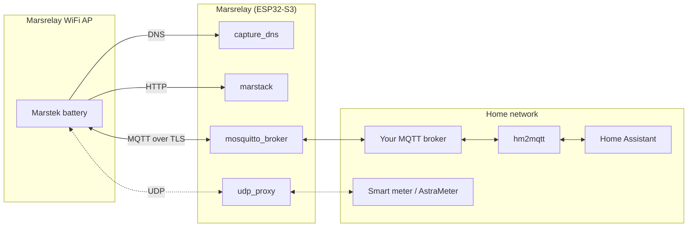

# Marsrelay

Marsrelay runs your Marstek Energy Storage system **completely offline**: a small ESP32-S3 device emulates the Marstek cloud locally, so the battery works without internet while all data and controls flow into your home automation via MQTT.

- **No cloud, no internet** — all data stays in your home network
- **No device hacking** — you only point the battery's WiFi at Marsrelay's access point
- **Home Assistant integration** via [hm2mqtt](https://github.com/tomquist/hm2mqtt)

<!-- marstek-family:start -->
**🔋 The Marstek ecosystem.** This repo is part of a family of open-source tools for Marstek batteries (B2500, Venus, Jupiter, …):

| Project | What it does |
|---|---|
| [hm2mqtt](https://github.com/tomquist/hm2mqtt) | Brings your battery into your smart home, turning its raw data into readable sensors and controls (e.g. in Home Assistant) |
| [hame-relay](https://github.com/tomquist/hame-relay) | Connects the official Marstek cloud/app and your local smart home so both work together, forwarding data whichever way your battery is set up |
| **marsrelay** (this repo) | Runs your battery completely offline, with no internet or Marstek cloud, while still sending all its data to your smart home |
| [AstraMeter](https://github.com/tomquist/astrameter) | Tells your battery your live grid usage (read from your existing meter) so it charges and discharges to avoid buying or selling power |
| [hmjs](https://github.com/tomquist/hmjs) | Sets up and configures B2500 batteries over Bluetooth, right from your web browser, with no app or account needed |
| [esphome-b2500](https://github.com/tomquist/esphome-b2500) | Continuously monitors and controls a B2500 over Bluetooth using a small ESP32 board |
<!-- marstek-family:end -->

## How It Works

Marstek batteries talk to two cloud services: an HTTP API and an MQTT broker. Marsrelay emulates both on one ESP32-S3:

1. **WiFi access point** (`wifi`): the battery connects to it, while Marsrelay stays connected to your home WiFi
2. **DNS capture** (`capture_dns`): every cloud hostname lookup is answered with Marsrelay's own IP
3. **Cloud HTTP emulation** (`marstack`): answers the Marstek cloud endpoints the battery calls (e.g. clock sync via `getDateInfoeu.php`)
4. **Cloud MQTT emulation** (`mosquitto_broker`): a TLS broker on port 8883 accepts the battery's cloud MQTT connection — battery data (`.../device/...` topics) is forwarded to your home broker, commands (`.../App/.../ctrl`) are relayed back
5. **UDP proxy** (`udp_proxy`): bridges power meter broadcasts between both networks for zero feed-in



The battery thinks it's online; the Marstek app keeps working via Bluetooth only. You still need **hm2mqtt** on top — Marsrelay only moves raw MQTT messages, hm2mqtt parses them and creates the Home Assistant entities. **[Hame Relay](https://github.com/tomquist/hame-relay)** is *not* needed: it bridges the real cloud, which an offline setup doesn't have.

## Setup

You need: an ESP32-S3 board ([single](https://amzn.to/429OJDX) with "octal" PSRAM, [3-pack](https://amzn.to/3PwGRVv), [3-pack mini](https://amzn.to/4qIjp8P) with "quad" PSRAM), [ESPHome](https://esphome.io/) (e.g. the Home Assistant add-on), an MQTT broker, and [MQTT Explorer](https://github.com/thomasnordquist/MQTT-Explorer).

### 1. Flash Marsrelay

Download [`marsrelay_esp32s3.yaml`](marsrelay_esp32s3.yaml) and adjust the `substitutions:` block at the top:

- **`wifi_ssid` / `wifi_password`**: your home WiFi
- **`ap_ssid` / `ap_password`**: the WiFi network your battery will connect to
- **`mqtt_broker` / `mqtt_username` / `mqtt_password`**: your home MQTT broker
- **`timezone`**: used to keep the battery clock in sync ([timezone list](https://en.wikipedia.org/wiki/List_of_tz_database_time_zones))
- **`udp_proxy_port`**: depends on your power meter / firmware (see the comment in the file)
- **`psram`**: must match your board ([details](https://esphome.io/components/psram/))

Then build and flash it with ESPHome.

### 2. Connect the battery

In the battery's WiFi settings, connect it to the Marsrelay access point (`ap_ssid` / `ap_password`). That's all the battery-side setup — no hacks, no firmware modification.

### 3. Find your device information

In MQTT Explorer (connected to your home broker), wait for a message on `marstek_energy/<deviceType>/device/<deviceId>/ctrl` — or `hame_energy/...` on older firmware. **Give this at least 30 minutes** — the first message usually arrives within 20, but longer is normal. Note down `deviceType` and `deviceId`.

For the quickest start, boot the ESP32 first and power-cycle the battery once Marsrelay is running: a battery that joined the access point earlier can stay quiet for a long time.

- Ignore `.../App/...` topics — those are commands *sent by* hm2mqtt, not by your battery.
- Nothing appearing? See [troubleshooting](docs/troubleshooting.md#no-device-topic-ever-appears). You can also read the ID from Hame Relay's startup logs instead of waiting (see [finding the encrypted ID](#finding-the-encrypted-id)).

### 4. Configure hm2mqtt

On current firmware the `deviceId` from step 3 is almost always a long **encrypted ID**, not the battery's MAC address. What goes into [hm2mqtt](https://github.com/tomquist/hm2mqtt) depends on the device family:

- **B2500/Saturn (HMA/HMB/HMF/HMK/HMJ types):** use the **Bluetooth MAC** as `deviceId` — never the encrypted ID — and add an `id_mappings` entry in Marsrelay. See [Device IDs](#device-ids-mac-address-vs-encrypted-id).
- **Venus, Jupiter and everything else:** use the ID from step 3 as `deviceId`, exactly as it appears in the topic.
- If the topic shows a plain 12-digit MAC (older firmware, or a B2500 configured for local MQTT): just use that — done.

## Device IDs: MAC Address vs. Encrypted ID

Every Marstek battery has a Bluetooth MAC address (12 hex characters, e.g. `009b08a571ee`), shown in the Marstek app and used by [hm2mqtt](https://github.com/tomquist/hm2mqtt) as the `deviceId`. In its cloud MQTT topics, however, a battery on current firmware identifies itself with a long **encrypted ID** instead — only old firmware still uses the plain MAC there, and a firmware update silently switches a battery over (see the [Hame Relay device matrix](https://github.com/tomquist/hame-relay/blob/main/docs/device-matrix.md) for which versions).

Marsrelay forwards topics as-is, so the ID from step 3 is whatever the battery uses. In the rare case that it's the plain MAC: configure it in hm2mqtt and you're done. Otherwise, follow the section for your device family:

### B2500 / Saturn (device types starting with HMA, HMB, HMF, HMK, HMJ)

- **hm2mqtt:** `deviceId` = the **Bluetooth MAC**, never the ID from the topic. hm2mqtt derives its own topic IDs from this value; pasting the topic ID instead sends commands to dead, double-encrypted topics (recognizable as ~96-character IDs in the Marsrelay log).
- **Marsrelay:** map the battery's topic ID to the MAC:

  ```yaml
  mosquitto_broker:
    # ...existing options...
    id_mappings:
      - device: "<id-from-the-device-topic>"   # from step 3
        external: "<bluetooth-mac>"
  ```

Marsrelay rewrites the IDs in both directions and automatically uses the form hm2mqtt expects per topic (plain MAC on `hame_energy/...`, hm2mqtt's encrypted variant on `marstek_energy/...`). The mapping is a harmless no-op when the IDs already match, so just always add it. Requires a current build from `main`; older configs that set the encrypted variant as `external` manually keep working.

> Exception: a B2500 configured for **local MQTT** (e.g. via [hmjs](https://tomquist.github.io/hmjs/)) publishes under its plain MAC — MAC in hm2mqtt, no mapping needed.

### Venus, Jupiter and all other device types (VNS…, JPLS…, HMG…, HMM…, …)

hm2mqtt uses the configured `deviceId` as-is for these devices, so pick one of two options:

- **Option A — encrypted ID in hm2mqtt (simplest):** configure the ID from step 3 as the `deviceId`, e.g. `DEVICE_0=JPLS-8H:<encrypted-id-from-the-device-topic>`.
- **Option B — MAC plus mapping:** keep the Bluetooth MAC as `deviceId` in hm2mqtt and add the same `id_mappings` entry as above (`device:` the encrypted ID, `external:` the MAC).

With multiple batteries, make sure each mapping pairs the IDs of the **same physical battery** — see [Finding the encrypted ID](#finding-the-encrypted-id).

### Finding the encrypted ID

1. **MQTT Explorer:** wait for the battery's `.../device/<deviceId>/ctrl` topic (step 3, 30 minutes or more). With multiple batteries, power all but one off to attribute the IDs unambiguously.
2. **Hame Relay startup logs:** temporarily install [Hame Relay](https://github.com/tomquist/hame-relay) with your Marstek account credentials — on startup it prints each device's MAC and encrypted ID:

   ```text
   Device 1:
     Device ID: 009b08a571ee
     Remote ID: defa85f58f79ab2d2b2818f0a8cd3ee3   <-- the encrypted ID
     Type: HMJ-2
   ```

   This works even if the battery never publishes (or has never connected to Marsrelay); uninstall Hame Relay again afterwards.

## Optional: Shelly UDP Emulator

Marsrelay can emulate a Shelly Gen2 energy meter (UDP JSON-RPC) directly on the ESP32, fed by ESPHome sensor values — based on the Shelly emulation in [AstraMeter](https://github.com/tomquist/AstraMeter) (formerly b2500-meter). Supports `EM.GetStatus` and `EM1.GetStatus`.

```yaml
sensor:
  - platform: template
    id: grid_power_w
    name: Grid Power
    unit_of_measurement: W

shelly_emulator:
  # Use the port expected by your Marstek/B2500 firmware
  # (e.g. 1010 / 2220 / 2222 / 2223)
  port: 1010
  device_id: marsrelay
  # One sensor (total) or three sensors (a/b/c phases)
  power_sensors:
    - grid_power_w
```

## Troubleshooting

See [docs/troubleshooting.md](docs/troubleshooting.md) for:

- [The battery doesn't react to commands (e.g. cd=1)](docs/troubleshooting.md#the-battery-doesnt-react-to-commands-eg-cd1)
- [No /device/ topic ever appears](docs/troubleshooting.md#no-device-topic-ever-appears)
- [Repeating getDateInfoeu.php requests and UDP proxy log lines](docs/troubleshooting.md#repeating-getdateinfoeuphp-requests-and-udp-proxy-log-lines) (spoiler: that's normal)
- [Communication stops after a few hours / broker crashes](docs/troubleshooting.md#communication-stops-after-a-few-hours-or-the-log-shows-broker-crashes)
- [The battery can't reach a power meter on my home network](docs/troubleshooting.md#the-battery-cant-reach-a-power-meter-on-my-home-network-eg-ecotracker)
- [hm2mqtt shows all entities as unavailable](docs/troubleshooting.md#hm2mqtt-shows-all-entities-as-unavailable)
- [Can I run Marsrelay on a Raspberry Pi?](docs/troubleshooting.md#can-i-run-marsrelay-on-a-raspberry-pi-instead-of-an-esp32)

## License

[MIT](LICENSE)
