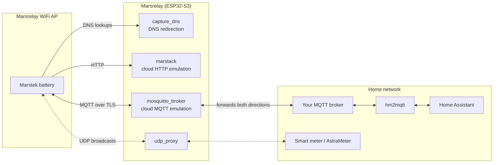

# Marsrelay

Marsrelay is a simple device that lets you use your Marstek Energy Storage system completely offline while still integrating it with your home automation setup.

## What is Marsrelay?

Marsrelay replaces the Marstek cloud service with a small device that runs locally in your home. Instead of your Marstek battery system connecting to the internet, it connects to Marsrelay, which then connects to your home automation system.

## Why Use Marsrelay?

- **Works Offline**: Your Marstek system doesn't need internet access
- **Privacy**: All data stays in your home network
- **Home Automation Integration**: Connect your Marstek system to home automation projects like [hm2mqtt](https://github.com/tomquist/hm2mqtt)
- **No Cloud Dependencies**: No need to rely on Marstek's cloud services
- **No Device Hacking Required**: The best part? You don't need to modify or hack your Marstek Energy Storage device at all. The only thing you need to do is configure your device to connect to Marsrelay's WiFi access point instead of your regular WiFi network.

## How It Works

Marstek batteries talk to two cloud services: an HTTP API (date/time sync and similar requests) and an MQTT broker (telemetry and control). Marsrelay emulates both on a single ESP32-S3, so the battery behaves exactly as if it were online:

1. **Creates a WiFi Network** (`wifi` component): Marsrelay opens its own WiFi access point that your Marstek device connects to, while at the same time staying connected to your home WiFi as a regular client
2. **Redirects Internet Requests** (`capture_dns` component): When the battery looks up any Marstek cloud hostname via DNS, Marsrelay answers with its own IP address, so all cloud traffic ends up at the ESP32
3. **Acts Like Marstek's HTTP Server** (`marstack` component): A web server responds to the Marstek cloud HTTP endpoints the battery calls (for example `GET /app/neng/getDateInfoeu.php`, which the battery uses to sync its clock), so the battery believes it is talking to the real cloud
4. **Acts Like Marstek's MQTT Broker** (`mosquitto_broker` component): An embedded TLS MQTT broker (port 8883) accepts the battery's cloud MQTT connection and bridges it to your home network:
   - Messages the battery publishes on `marstek_energy/<deviceType>/device/<deviceId>/...` (or `hame_energy/...` on older firmware) are forwarded to your home MQTT broker
   - Control messages published on your home broker under `marstek_energy/<deviceType>/App/<deviceId>/ctrl` (for example by [hm2mqtt](https://github.com/tomquist/hm2mqtt)) are delivered back to the battery
5. **Bridges Power Meter Traffic** (`udp_proxy` component): UDP broadcasts used for power meter discovery and zero feed-in control are relayed between the battery's network and your home network



## The Result

Your Marstek Energy Storage system operates completely offline, thinking it's connected to Marstek's cloud, while all its data and controls are available to your home automation system through MQTT.

Note that the official Marstek app can no longer reach the battery through the cloud in this setup — that's the point of going offline. You can still use the app via Bluetooth when you are near the battery.

## Marsrelay, hm2mqtt and Hame Relay

Marsrelay is one of three companion projects that each solve a different part of Marstek integration and can be combined as needed:

| Project | Role |
|---------|------|
| **Marsrelay** (this project) | Replaces the Marstek **cloud** locally. Batteries connect to it over WiFi; it forwards their raw MQTT messages to your home broker. Runs on an ESP32-S3. |
| **[hm2mqtt](https://github.com/tomquist/hm2mqtt)** | Parses the raw battery MQTT messages and integrates them with Home Assistant (auto-discovery, sensors, controls). Runs as a Home Assistant add-on or Docker container. |
| **[Hame Relay](https://github.com/tomquist/hame-relay)** | Bridges MQTT between the **real** Marstek cloud and your local broker, for setups where the battery stays cloud-connected. |

In a Marsrelay setup:

- **You still need hm2mqtt.** Marsrelay only moves raw MQTT messages; it doesn't parse them or create Home Assistant entities. hm2mqtt works the same whether the data arrives via Marsrelay or via Hame Relay.
- **You don't need Hame Relay.** With Marsrelay the battery never talks to the real cloud, so there is nothing to bridge. The one exception: temporarily installing Hame Relay is a convenient way to look up a battery's encrypted device ID (see [Device IDs](#device-ids-mac-address-vs-encrypted-id) below) — you can uninstall it again afterwards.

---

## Getting Started

### Prerequisites

- ESPHome installed (e.g., via the ESPHome addon in Home Assistant)
- An MQTT broker running on your network
- A tool like [MQTT Explorer](https://github.com/thomasnordquist/MQTT-Explorer) to monitor MQTT messages

### Step 0: Get an ESP32-S3 Board

You'll need an ESP32-S3 development board. You can purchase one here:

- Single board: [Amazon](https://amzn.to/429OJDX) with "octal" PSRAM
- 3-pack (better value): [Amazon](https://amzn.to/3PwGRVv)
- 3-pack mini: [Amazon](https://amzn.to/4qIjp8P) with "quad" PSRAM

### Step 1: Configure ESPHome

Copy the following ESPHome configuration and save it as `marsrelay_esp32s3.yaml`.

```yaml
substitutions:
  device_name: marsrelay-esp32s3
  friendly_name: Marsrelay ESP32S3
  wifi_ssid: "your-home-wifi-ssid"
  wifi_password: "your-home-wifi-password"
  ap_ssid: "marsrelay"
  ap_password: "marsrelay"
  mqtt_broker: 192.168.1.100
  mqtt_username: ""
  mqtt_password: ""
  mqtt_topic_prefix: "marsrelay"
  # Timezone used to sync the battery clock (see https://en.wikipedia.org/wiki/List_of_tz_database_time_zones).
  timezone: "Europe/Berlin"
  # UDP proxy port for power meter discovery (see https://github.com/tomquist/AstraMeter)
  # - Port 1010: Shelly Pro 3EM for B2500 firmware up to v224, Jupiter, Venus
  # - Port 2220: Shelly Pro 3EM for B2500 firmware v226+
  # - Port 2222: Shelly 3EM gen3
  # - Port 2223: Shelly Pro EM50
  # - Port 12345: CT001/CT002/CT003
  udp_proxy_port: "1010"
  psram:
    # Set to true if your ESP32S3 has PSRAM.
    enabled: true
    # This needs to be set correctly! See https://esphome.io/components/psram/ for more information.
    mode: quad

esphome:
  name: ${device_name}
  friendly_name: ${friendly_name}

psram:
  mode: ${psram.mode}
  disabled: ${false if psram.enabled else true}

esp32:
  board: esp32-s3-devkitc-1
  variant: esp32s3
  framework:
    type: esp-idf
    sdkconfig_options:
      CONFIG_LWIP_IPV6: y
      CONFIG_ESP_TLS_INSECURE: y  # Allow skipping certificate verification
      CONFIG_ESP_TLS_SKIP_SERVER_CERT_VERIFY: y  # Skip server certificate verification
      CONFIG_LWIP_MAX_SOCKETS: "58"  # Reduced from 64 to ensure LWIP_SOCKET_OFFSET >= 6 (FD_SETSIZE=64, so offset = 64-58=6)
      CONFIG_LWIP_TCP_MSL: "30"  # Reduce TIME_WAIT timeout from default 60s to 30s (in seconds)
      CONFIG_LWIP_SOCKET_OFFSET: "6"  # Required for esp_vfs_console compatibility (must be >= 6 for esp_vfs_console)

external_components:
  - source:
      type: git
      url: https://github.com/tomquist/marsrelay
      ref: main

logger:

# Keeps the ESP32 system clock in sync so the marstack component serves the
# correct date/time to the battery (GET /app/neng/getDateInfoeu.php).
time:
  - platform: sntp
    id: sntp_time
    timezone: ${timezone}

wifi:
  ssid: ${wifi_ssid}
  password: ${wifi_password}
  ap:
    ssid: ${ap_ssid}
    password: ${ap_password}
  use_psram: ${psram.enabled}

capture_dns:
  id: capture_dns_server

# UDP proxy bridges broadcasts between AP and STA networks for power meter discovery
# Add multiple entries if you need to support different firmware versions
udp_proxy:
  - port: ${udp_proxy_port}

mqtt:
  id: mqtt_client
  broker: ${mqtt_broker}
  username: ${mqtt_username}
  password: ${mqtt_password}
  on_connect:
    - lambda: |-
        id(mqtt_client).subscribe("marstek_energy/+/App/+/ctrl", [=](const std::string &topic, const std::string &payload) {
          ESP_LOGD("MQTT", "Received control message: %s", topic.c_str());
          if (topic.find("/App/") == std::string::npos) {
            ESP_LOGD("MQTT", "Not a control message, skipping");
            return;
          }
          if (topic.find("/ctrl") == std::string::npos) {
            ESP_LOGD("MQTT", "Not a control message, skipping");
            return;
          }
          id(local_broker).publish_message(topic, payload);
        });

mosquitto_broker:
  id: local_broker
  tls: true
  tls_skip_verification: true
  port: 8883
  max_clients: 5
  on_message:
    # Only forward messages containing /device/
    - if:
        condition:
          lambda: 'return topic.find("/device/") != std::string::npos;'
        then:
          - mqtt.publish:
              topic: !lambda |-
                return topic;
              payload: !lambda |-
                return payload;

web_server:
  port: 80
  version: 3

marstack:
  id: marstack_http
  on_request:
    - logger.log:
        format: "HTTP %s %s body=%s"
        args: [method.c_str(), url.c_str(), body.c_str()]
    - mqtt.publish:
        topic: ${mqtt_topic_prefix}/request
        payload: !lambda |-
          return json::build_json([&](JsonObject root) {
            root["source_ip"] = source_ip;
            root["url"] = url;
            root["method"] = method;
            root["body"] = body;
          });
```

### Step 2: Adjust Configuration Values

Edit the `substitutions` section at the top of the configuration file:

- **`wifi_ssid`** and **`wifi_password`**: Your home WiFi network credentials (so Marsrelay can connect to your network)
- **`ap_ssid`** and **`ap_password`**: The WiFi network name and password that your Marstek device will connect to (default is "marsrelay" / "marsrelay")
- **`mqtt_broker`**: The IP address of your MQTT broker (e.g., `192.168.1.100`)
- **`mqtt_username`** and **`mqtt_password`**: Your MQTT broker credentials (leave empty if not required)
- **`timezone`**: Your local timezone (e.g. `Europe/Berlin`). Marsrelay uses this to keep the battery's clock in sync; if it's wrong the battery time will be off. See the [list of timezones](https://en.wikipedia.org/wiki/List_of_tz_database_time_zones).
- **`psram.enabled`** and **`psram.mode`**: Set according to your ESP32-S3 board specifications

### Step 3: Build and Flash

1. Open ESPHome (e.g., via the Home Assistant ESPHome addon)
2. Upload the configuration file
3. Build the firmware image
4. Flash the image to your ESP32-S3 device

### Step 4: Configure Your Marstek Energy Storage Device

1. On your Marstek Energy Storage device, go to the WiFi/Network settings
2. Configure it to connect to the access point named "marsrelay" (or whatever you set as `ap_ssid`)
3. Enter the password you configured (default is "marsrelay")
4. Save the configuration

**That's it!** No hacking, no firmware modifications, no complicated setup. Just change the WiFi network your Marstek device connects to.

### Step 5: Find Your Device Information

1. Open MQTT Explorer (or another MQTT client) and connect to your MQTT broker
2. Wait for a message to appear on the topic: `marstek_energy/<deviceType>/device/<deviceId>/ctrl`. The battery publishes on its own schedule — **this can take up to 20 minutes**, so keep MQTT Explorer connected and be patient
3. Note down the **`deviceType`** and **`deviceId`** from the topic

> **Check both topic prefixes.** Depending on its firmware generation, the battery uses either `marstek_energy/...` or the older `hame_energy/...` prefix for its cloud topics, so the `/device/` topic may appear under either one. If your battery uses `hame_energy`, one config adjustment is needed so commands reach it — see [Troubleshooting](#the-battery-doesnt-react-to-commands-eg-cd1).

> **Only topics containing `/device/` come from your battery.** You will likely also see topics like `marstek_energy/<deviceType>/App/<id>/ctrl` — these are control messages *sent by* hm2mqtt (or the app), not by your battery. They tell you nothing about your battery's device ID, so ignore them in this step.

Depending on the battery's firmware version, the `deviceId` in the topic is either the battery's Bluetooth MAC address (12 hex characters, e.g. `009b08a571ee`) or a much longer encrypted ID. Both are normal — see [Device IDs](#device-ids-mac-address-vs-encrypted-id) for what this means for your hm2mqtt configuration.

If nothing has appeared after 20 minutes, you don't have to keep waiting: you can look the device ID up via Hame Relay instead — temporarily install it with your Marstek account credentials and read the ID from its startup logs (see [Finding the encrypted ID](#finding-the-encrypted-id) for the details). Also work through [Troubleshooting](#troubleshooting), because a missing `/device/` topic usually means the battery isn't sending data yet — knowing the ID alone won't fix that.

### Step 6: Configure hm2mqtt

Copy the `deviceType` and `deviceId` you found into your [hm2mqtt](https://github.com/tomquist/hm2mqtt) configuration file. Your Marstek Energy Storage system is now integrated with your home automation!

> If the `deviceId` from Step 5 is a long encrypted ID rather than a MAC address, what to put into hm2mqtt depends on your device family — B2500/Saturn devices always get the Bluetooth MAC, other devices get the encrypted ID (or an ID mapping). Read [Device IDs](#device-ids-mac-address-vs-encrypted-id) before continuing.

---

## Device IDs: MAC Address vs. Encrypted ID

Every Marstek battery has a Bluetooth MAC address (12 hex characters, e.g. `009b08a571ee`). This is what [hm2mqtt](https://github.com/tomquist/hm2mqtt) normally uses as the `deviceId`, and it's shown in the Marstek app and Bluetooth tools.

However, on newer firmware the battery does **not** use its MAC in the cloud MQTT topics. Instead it uses a long **encrypted ID** derived from the MAC — for example `defa85f58f79ab2d2b2818f0a8cd3ee3` or an even longer string. Which form your battery uses depends on the model and firmware version (for example HMJ-2 switched with firmware v108, Jupiter/JPLS with v136 — Jupiter C+ users first noticed this on firmware v142; see the [Hame Relay device matrix](https://github.com/tomquist/hame-relay/blob/main/docs/device-matrix.md) for details). A firmware update can silently switch a battery from MAC to encrypted ID — if your battery suddenly stops reacting to commands after an update, this is almost certainly why (see [Troubleshooting](#troubleshooting)).

Marsrelay forwards the battery's topics as-is, so the ID you found in [Step 5](#step-5-find-your-device-information) is whatever the battery uses. If that ID is the plain MAC address, you're done — configure it in hm2mqtt and skip the rest of this section. If it's an encrypted ID, what to configure **depends on the device family**, because hm2mqtt treats them differently.

### B2500 / Saturn (device types starting with HMA, HMB, HMF, HMK, HMJ)

Configure the **Bluetooth MAC** as the `deviceId` in hm2mqtt — even though the topics show an encrypted ID. hm2mqtt knows the B2500 encryption scheme and derives the encrypted topic ID from the MAC by itself, so its topics match the battery automatically. No `id_mappings` in Marsrelay are needed.

Do **not** paste the encrypted ID from the `/device/` topic into hm2mqtt: hm2mqtt would encrypt it a *second* time and publish commands to a nonsense topic that the battery never sees. You can recognize this mistake in the Marsrelay log by extra-long IDs (~96 characters instead of 32) in the `.../App/.../ctrl` topics.

> **B2500 configured for local MQTT:** If you configured your B2500 to talk to your local MQTT broker directly (e.g. via [hmjs](https://tomquist.github.io/hmjs/)), it publishes under its plain MAC regardless of firmware version. Same conclusion: use the MAC in hm2mqtt, and no ID handling is needed.

### Venus, Jupiter and all other device types (VNS…, JPLS…, HMG…, HMM…, …)

For these devices hm2mqtt uses the configured `deviceId` exactly as-is, and their encrypted ID cannot be computed from the MAC alone (it also depends on a per-device salt that only exists in your Marstek cloud account). So you have two options:

#### Option A: Use the encrypted ID directly in hm2mqtt

The simplest approach: configure the encrypted ID from Step 5 as the `deviceId` in hm2mqtt, e.g.

```yaml
devices:
  - deviceType: "JPLS-8H"
    deviceId: "<encrypted-id-from-the-device-topic>"
```

or, for a Docker setup, `DEVICE_0=JPLS-8H:<encrypted-id-from-the-device-topic>`.

#### Option B: Let Marsrelay translate between encrypted ID and MAC

Alternatively, keep the familiar Bluetooth MAC in your hm2mqtt configuration and have Marsrelay rewrite the ID segment of every topic it forwards. Add an `id_mappings` list to the `mosquitto_broker:` block:

```yaml
mosquitto_broker:
  id: local_broker
  # ...existing options...
  id_mappings:
    - device: "<encrypted-id-from-the-device-topic>"
      external: "<bluetooth-mac-address>"
```

For each pair, `device` is the encrypted ID that appears in the topic on the local mosquitto broker (the one the battery uses for its cloud MQTT topics), and `external` is the Bluetooth MAC address that hm2mqtt uses as the device ID. Translation is applied in both directions automatically: control messages from hm2mqtt on `.../App/<external>/...` are rewritten to `.../App/<device>/...` before being delivered to the battery, and status messages from the battery on `.../device/<device>/...` are rewritten to `.../device/<external>/...` before being forwarded out.

With this option, use the `external` ID (the Bluetooth MAC) in your hm2mqtt configuration. When you have multiple batteries, make sure each mapping pairs the encrypted ID and the MAC of the **same physical battery** (see [Finding the encrypted ID](#finding-the-encrypted-id) — power off all but one battery if you're unsure which ID belongs to which).

### Finding the encrypted ID

(You only need this for Venus/Jupiter and the other non-B2500 device types — for B2500/Saturn devices the Bluetooth MAC is all you need, see above.)

Two ways to find out which encrypted ID belongs to which battery:

1. **MQTT Explorer** (no extra software): follow [Step 5](#step-5-find-your-device-information) and wait for the battery to publish on `marstek_energy/<deviceType>/device/<deviceId>/ctrl`. With multiple batteries, power all but one off so you can attribute the ID unambiguously. Remember: ignore `.../App/...` topics — only `/device/` topics come from the battery.
2. **Hame Relay startup logs**: temporarily install [Hame Relay](https://github.com/tomquist/hame-relay) with your Marstek account credentials. On startup it prints a block per device including the Bluetooth MAC and the derived encrypted ID (the `Remote ID:` line):

   ```text
   Device 1:
     Name: ...
     Device ID: 009b08a571ee
     Remote ID: defa85f58f79ab2d2b2818f0a8cd3ee3   <-- the encrypted ID
     MAC: 009b08a571ee
     Type: HMJ-2
     ...
   ```

   Hame Relay computes the ID from your account's device list, so this works even if the battery never publishes on a `/device/` topic (e.g. because you gave up waiting in Step 5) and even before it has ever connected to Marsrelay. You can uninstall Hame Relay again afterwards — Marsrelay setups don't need it running.

---

## Troubleshooting

### The battery doesn't react to commands (e.g. `cd=1`)

Marsrelay's log shows `Received control message: ...` but the battery never answers. The command is reaching Marsrelay, but it doesn't match the topic the battery actually listens on. There are two common causes — compare the `.../device/<deviceId>/...` topic the battery publishes on (see [Step 5](#step-5-find-your-device-information)) with the topic your commands arrive on:

**Cause 1: Wrong topic prefix (`hame_energy` vs. `marstek_energy`).** Batteries use one of two cloud topic prefixes depending on their firmware generation: older firmware talks to the 2024-generation cloud broker using `hame_energy/...`, newer firmware to the 2025 generation using `marstek_energy/...`. The example configuration only forwards commands for `marstek_energy/+/App/+/ctrl`. If your battery's `/device/` topics appear under `hame_energy/...`, subscribe to that prefix as well (or instead) in the `mqtt.on_connect` lambda:

```yaml
mqtt:
  # ...
  on_connect:
    - lambda: |-
        id(mqtt_client).subscribe("hame_energy/+/App/+/ctrl", [=](const std::string &topic, const std::string &payload) {
          ESP_LOGD("MQTT", "Received control message: %s", topic.c_str());
          id(local_broker).publish_message(topic, payload);
        });
        // keep the existing marstek_energy subscription from the example config here as well
```

The outgoing direction needs no change: the `mosquitto_broker` `on_message` forwarding matches any topic containing `/device/`, regardless of prefix.

**Cause 2: The device ID in the topic doesn't match what hm2mqtt publishes to.** Newer firmware switches the battery from its plain MAC address to an [encrypted ID](#device-ids-mac-address-vs-encrypted-id) in its MQTT topics (e.g. Jupiter C+ with firmware v142), so this often shows up right after a firmware update. The fix depends on the device family:

- **Venus/Jupiter and other non-B2500 devices:** find the battery's encrypted ID (see [Finding the encrypted ID](#finding-the-encrypted-id)) and either configure it as the `deviceId` in hm2mqtt or add an `id_mappings` entry in Marsrelay. Your setup stays fully offline either way.
- **B2500/Saturn devices (HMA/HMB/HMF/HMK/HMJ):** configure the **Bluetooth MAC** as the `deviceId` — hm2mqtt derives the encrypted ID itself. If you pasted the encrypted ID from the topic into hm2mqtt, that's the problem: commands end up on a double-encrypted topic (visible as ~96-character IDs in the Marsrelay log). See [Device IDs](#device-ids-mac-address-vs-encrypted-id).

### No `.../device/...` topic ever appears in MQTT Explorer

Work through this checklist:

1. **Are you looking at the right topics?** Topics under `marstek_energy/<deviceType>/App/...` are commands *from* hm2mqtt, not data from your battery. Only `.../device/...` topics come from the battery — and they may appear under the `hame_energy/...` prefix instead of `marstek_energy/...` depending on firmware, so watch both.
2. **Wait long enough.** The battery can take up to 20 minutes to publish. Keep MQTT Explorer connected the whole time.
3. **Is the battery really connected to the Marsrelay access point?** The Marstek app sometimes reports a successful WiFi change even though the battery didn't actually connect. Check the Marsrelay logs (web interface or USB): when the battery is connected, you'll see its HTTP requests, e.g. `HTTP GET /app/neng/getDateInfoeu.php`. If those requests appear but no MQTT `/device/` topic does, the battery is connected and the problem is on the MQTT side (see next points).
4. **Can Marsrelay reach your home MQTT broker?** Verify `mqtt_broker`, `mqtt_username` and `mqtt_password` in the substitutions, and check the ESPHome logs for MQTT connection errors.
5. **Is the ESP32 stable?** Watch the logs via USB for a crash loop, and make sure the `psram` settings match your board.

If you only need the device ID while you keep debugging, you don't have to wait for the topic: get it from Hame Relay's startup logs instead (see [Finding the encrypted ID](#finding-the-encrypted-id)).

### The log repeats `getDateInfoeu.php` requests and UDP proxy messages — is something wrong?

No — that's what healthy operation looks like. `HTTP GET /app/neng/getDateInfoeu.php` is the battery checking in with the (emulated) cloud, and the `udp_proxy` lines are power meter packets being bridged between the networks. Both repeat at fixed intervals for as long as the battery is connected.

Two related things that are easy to misread:

- The messages on `<mqtt_topic_prefix>/request` (e.g. `marsrelay/request`) on your home broker, like `{"source_ip":...,"url":"/app/neng/getDateInfoeu.php",...}`, are **diagnostic logs** of the battery's HTTP requests — they are not battery data and you don't need to do anything with them.
- The battery does **not** push its telemetry (SoC, solar power, ...) on its own. That data only appears under the `.../device/...` topics when something requests it — which is exactly what [hm2mqtt](https://github.com/tomquist/hm2mqtt) does (e.g. by sending `cd=1`). If you only run Marsrelay without hm2mqtt, seeing nothing but `request` messages is expected.

### Communication stops after a few hours, or the log shows broker crashes

If the ESP32 log shows `***ERROR*** A stack overflow in task mosq_broker` or `Unable to accept new connection, system socket count has been exceeded`, first make sure you're on the latest `main` — earlier versions of the embedded broker had crash bugs that have since been fixed. Beyond that:

- Some users report better long-term stability with `CONFIG_LWIP_MAX_SOCKETS: "32"` and `CONFIG_LWIP_SOCKET_OFFSET: "16"` in the `sdkconfig_options` (instead of the defaults from the example config).
- A power cycle of the ESP32 restores communication as a stopgap.
- The log line `TLS client: certificate verification relaxed (CN check disabled, ...)` is expected with `tls_skip_verification: true` and is not an error.
- If crashes persist, double-check the `psram` settings match your board, and consider trying a standard ESP32-S3 devkit board.

Long-running dropouts where MQTT and UDP stop together while WiFi stays up are still being investigated in [issue #10](https://github.com/tomquist/marsrelay/issues/10) — if you're affected, the debugging steps and current findings are collected there.

### The battery can't reach a power meter on my home network (e.g. EcoTracker)

The Marsrelay access point is a separate network, so devices on your home LAN are not directly reachable from the battery. The `udp_proxy` component bridges exactly one thing: **UDP broadcasts** used by the supported meter protocols (Shelly, CT00x). Meters that are polled over **TCP** — such as the everHome EcoTracker — cannot be bridged this way ([issue #16](https://github.com/tomquist/marsrelay/issues/16)).

Workaround: bring the meter reading into ESPHome as a sensor (for example imported from Home Assistant) and serve it to the battery with the [Shelly UDP emulator](#optional-shelly-udp-emulator-issue-6) directly on the ESP32.

### hm2mqtt shows all entities as unavailable (or values frozen at old state)

hm2mqtt is waiting for data under a `deviceId` that doesn't correspond to what the battery publishes. Check the `deviceId` configured in hm2mqtt against the ID in the battery's `.../device/<deviceId>/...` topic: for B2500/Saturn devices the configured ID must be the Bluetooth MAC (hm2mqtt derives the encrypted topic ID from it), for all other devices it must match the topic ID exactly (or be connected via an `id_mappings` entry). See [Device IDs](#device-ids-mac-address-vs-encrypted-id).

### Can I run Marsrelay on a Raspberry Pi instead of an ESP32?

Not with this codebase — it's an ESPHome project. But the concept ports: you'd need a WiFi hotspot, a DNS server that resolves every query to the Pi itself, an HTTP server implementing the Marstek cloud endpoints (see `components/marstack/` for the protocol), and a TLS-enabled MQTT broker on port 8883 that bridges to your main broker (see `components/mosquitto_broker/` for the topic handling). The [How It Works](#how-it-works) section describes how the pieces fit together.

---

## Optional: Shelly UDP Emulator (Issue #6)

Marsrelay can emulate a Shelly Gen2 energy meter (UDP JSON-RPC) using ESPHome sensor values.
This is based on the Shelly emulation implemented in <https://github.com/tomquist/AstraMeter> (formerly b2500-meter).

Example:

```yaml
sensor:
  - platform: template
    id: grid_power_w
    name: Grid Power
    unit_of_measurement: W

shelly_emulator:
  # Use the port expected by your Marstek/B2500 firmware
  # (e.g. 1010 / 2220 / 2222 / 2223)
  port: 1010
  device_id: marsrelay
  # One sensor (total) or three sensors (a/b/c phases)
  power_sensors:
    - grid_power_w
```

Supported methods:
- `EM.GetStatus` (returns `a_act_power`, `b_act_power`, `c_act_power`, `total_act_power`)
- `EM1.GetStatus` (returns `act_power`)

## Technical Details

This repository contains ESPHome external components for building Marsrelay:

### Components

- **`mosquitto_broker`**: An embedded MQTT broker that forwards messages from Marstek devices to your main MQTT broker
- **`marstack`**: A web server component that implements Marstek's API endpoints
- **`capture_dns`**: DNS redirection component that intercepts DNS queries and redirects them to the device
- **`udp_proxy`**: UDP proxy component that bridges UDP broadcasts between the AP network (where Marstek devices connect) and the STA network (your home network). This enables zero feed-in control by forwarding UDP discovery/control packets between networks. Supports multiple ports.
- **`shelly_emulator`**: Shelly UDP (Gen2) emulator for `EM.GetStatus`/`EM1.GetStatus` based on ESPHome sensor(s). Can be used to provide Shelly-compatible power readings directly from the ESP.
- **`wifi`**: Patched WiFi component to support simultaneous access point while station mode is enabled

### Requirements

- ESP32-S3 device (ESP-IDF framework)
- ESPHome
- MQTT broker on your network

## License

MIT License

Copyright (c) 2024

Permission is hereby granted, free of charge, to any person obtaining a copy
of this software and associated documentation files (the "Software"), to deal
in the Software without restriction, including without limitation the rights
to use, copy, modify, merge, publish, distribute, sublicense, and/or sell
copies of the Software, and to permit persons to whom the Software is
furnished to do so, subject to the following conditions:

The above copyright notice and this permission notice shall be included in all
copies or substantial portions of the Software.

THE SOFTWARE IS PROVIDED "AS IS", WITHOUT WARRANTY OF ANY KIND, EXPRESS OR
IMPLIED, INCLUDING BUT NOT LIMITED TO THE WARRANTIES OF MERCHANTABILITY,
FITNESS FOR A PARTICULAR PURPOSE AND NONINFRINGEMENT. IN NO EVENT SHALL THE
AUTHORS OR COPYRIGHT HOLDERS BE LIABLE FOR ANY CLAIM, DAMAGES OR OTHER
LIABILITY, WHETHER IN AN ACTION OF CONTRACT, TORT OR OTHERWISE, ARISING FROM,
OUT OF OR IN CONNECTION WITH THE SOFTWARE OR THE USE OR OTHER DEALINGS IN THE
SOFTWARE.
